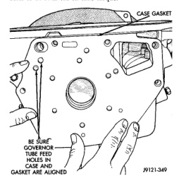
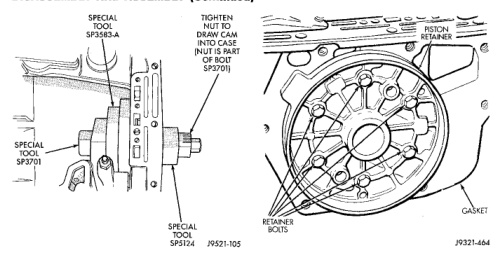

# DISASSEMBLY AND ASSEMBLY (Continued)

smaller than retainer and cannot be installed over retainer.

(14) Position overdrive piston retainer on transmission case and align bolt holes in retainer, gasket and case (Fig. 153). Then install and tighten retainer bolts to 17 N·m (13 ft. lbs.) torque.

*Fig. 152 Pressing Overdrive Clutch Cam Into Case]*
- SPECIAL TOOL SP-3701
- TIGHTEN NUT TO DRIVE CAM INTO CASE INLET IS TIGHT AGAINST SPECIAL TOOL SP-5134

*Fig. 153 Installing/Aligning Case Gasket]*
- CASE GASKET
- BE SURE GOVERNOR FEED HOLES IN GASKET ARE ALIGNED

(15) Install new seals on overdrive piston.

[Figure: Fig. 153 Aligning Overdrive Piston Retainer]
- PISTON RETAINER
- RETAINER BOLTS
- GASKET

(16) Stand transmission case upright on bellhousing.

(17) Position Guide Ring 8114-1 on outer edge of overdrive piston retainer.

(18) Position Seal Guide 8114-3 on inner edge of overdrive piston retainer.

(19) Install overdrive piston in overdrive piston retainer by: aligning locating lugs on overdrive piston to the two mating holes in retainer.

(a) Aligning locating lugs on overdrive piston to the two mating holes in retainer.

(b) Lubricate overdrive piston seals with Mopar® Door Ease, or equivalent.

(c) Install piston over Seal Guide 8114-3 and inside Guide Ring 8114-1.

(d) Push overdrive piston into position in retainer.

(e) Verify that the locating lugs entered the lug bores in the retainer.

**NOTE: INSTALL THE REMAINING TRANSMISSION COMPONENTS AND OVERDRIVE UNIT.**

## FRONT SERVO PISTON

### DISASSEMBLY

(1) Remove seal ring from rod guide (Fig. 154).

(2) Remove small snap ring from servo piston rod. Then remove piston rod, spring and washer from piston.

(3) Remove and discard servo component O-ring and seal rings.