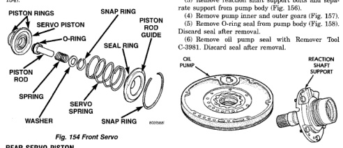
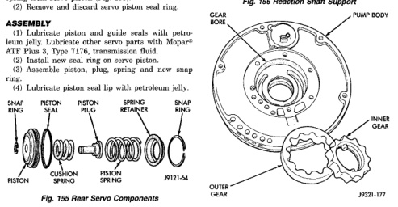

*Fig. 154*

1000

Clean and inspect front servo components. (1) Lubricate new O-ring and seal rings with petroleum ielly and install them on piston, guide and rod. (2) Install rod in piston. Install spring and washer on rod. Compress spring and install snap ring (Fig. 154).

(1) Remove small snap ring and remove plug and spring from servo piston (Fig. 155). (2) Remove and discard servo piston seal ring.

*Fig. 155 Rear Servo Components*

(1) Mark position of support in oil pump body for assembly alignment reference. Use scriber or paint to make alignment marks. (2) Place pump body on two wood blocks. (3) Remove reaction shaft support bolts and separate support from pump body (Fig. 156). (4) Remove pump inner and outer gears (Fig. 157). (5) Remove O-ring seal from pump body (Fig. 158). Discard seal after removal. (6) Remove oil pump seal with Remover Tool C-3981. Discard seal after removal.

*J9321-176*

*Fig. 156 Reaction Shaft Support*

*Fig. 157 Pump Gear*

*Fig. 155*
