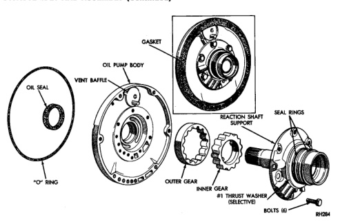

*Fig. 159*

(1) Position pump housing on clean, smooth surface with gear cavity facing down. (2) Remove bushing with Tool Handle C-4171 and Bushing Remover SP-3550 (Fig. 159).

(1) Assemble Cup Tool SP-3633. Nut SP-1191 and Bushing Remover SP-5301 (Fig. 161). (2) Hold cup tool firmly against reaction shaft. Thread remover tool into bushing as far as possible by hand. (3) Using wrench, thread remover tool an additional 3-4 turns into bushing to firmly engage tool. (4) Tighten tool hex nut against cup tool to pull bushing from shaft. Clean all chips from shaft and support after bushing removal.

(1) Assemble Tool Handle C-4171 and Bushing Installer SP-5118. (2) Place bushing on installer tool and start bushing into shaft. (3) Tap bushing into place until Installer Tool SP-5118 bottoms in pump cavity. Keep tool and bushing square with bore. Do not allow bushing to become cocked during installation. (4) Stake pump bushing in two places with blunt punch. Remove burrs from stake points with knife blade (Fig. 160).

(1) Place reaction shaft support upright on a clean. smooth surface. (2) Assemble Bushing Installer Tools C-4171 and SP-5302. Then slide new bushing onto installer tool (Fig. 161). (3) Start bushing in shaft. Tap bushing into shaft until installer tool bottoms against support flange. (4) Clean reaction shaft support thoroughly after bushing replacement (to remove any chips). (1) Lubricate pump gears with transmission fluid and install them in pump body. (2) Install thrust washer on reaction shaft support hub. Lubricate washer with petroleum jelly or transmission fluid before installation. (3) If reaction shaft seal rings are being replaced, install new seal rings on support hub. Lubricate seal rings with transmission fluid or petroleum jelly after installation. Squeeze each ring until ring ends are securely hooked together.
