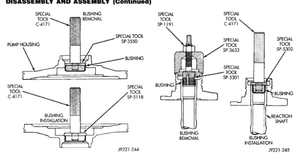
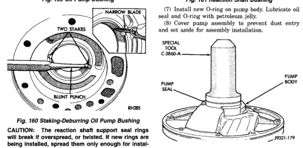

*Fig. 159 Oil Pump Bushing*

CAUTION: The reaction shaft support seal rings will break if overspread, or twisted. If new rings are being installed, spread them only enough for installation. Also be very sure the ring ends are securely hooked together after installation. Otherwise, the rings will either prevent pump installation, or break during installation.

(4) Align and install reaction shaft support on pump body. (5) Install bolts attaching reaction shaft support to pump. Tighten bolts to 20 N-m (175 in. Ibs.) torque. (6) Install new pump seal with Installer Tool C-3860-A (Fig. 162). Use hammer or mallet to tap seal into place.

*Fig. 162 Oil Pump Seal*

(1) Remove waved snap ring and remove reaction plate, clutch plates and clutch discs. (2) Compress clutch piston retainer and piston springs with Compressor Tool C-3863-A (Fig. 163). (3) Remove retainer snap ring and remove compressor tool.

*Fig. 162*
