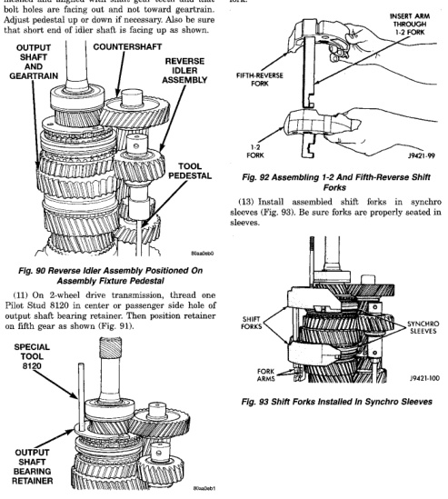

*Fig. 90*

(10) Position reverse idler in support cup of assembly fixture (Fig. 90). Be sure idler gear is properly meshed and aligned with shaft gear teeth and that bolt holes are facing out and not toward geartrain. Adiust pedestal up or down if necessary. Also be sure that short end of idler shaft is facing up as shown.

*Fig. 91 Positioning Output Shaft Bearing Retainer For Rear Housing Installation*

(12) Assemble 1-2 and fifth reverse-shift forks (Fig. 92). Arm of fifth-reverse fork goes through slot in 1-2 fork.

*Fig. 92 Assembling 1-2 And Fifth-Reverse Shift Forks*

*Fig. 93 Shift Forks Installed In Synchro Sleeves*
