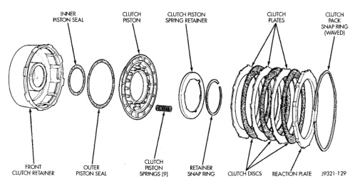
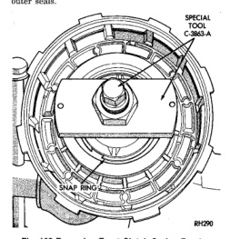

### 21 - 280 TRANSMISSION AND TRANSFER CASE -

(4) Remove clutch piston springs (Fig. 164). Note position of piston springs for assembly reference. (5) Remove clutch piston from retainer with a twisting motion. (6) Remove and discard clutch piston inner and outer seals.

*Fig. 163 Removing Front Clutch Spring Retainer Snap Ring*

(7) Assemble Tool Handle C-4171 and Bushing Remover SP-3629 (Fig. 165). (8) Insert remover tool in bushing and drive bushing straight out of clutch retainer.

NOTE: The 46RE transmission uses 3 discs in the front clutch. The 47RE transmission uses 4 discs.

(1) Mount Bushing Installer SP-5511 on tool handle (Fig. 165). (2) Slide new bushing onto installer tool and start bushing into retainer. (3) Tap new bushing into place until installer tool bottoms against clutch retainer. (4) Remove installer tools and clean retainer thoroughly. (5) Soak clutch discs in transmission fluid. (6) Install new inner and outer seals on clutch piston. Be sure seal lips face interior of retainer. (7) Lubricate new inner and outer piston seals with Ru-Glyde, or Mopar® Door Ease. (8) Install clutch piston in retainer. Use twisting motion to seat piston in bottom of retainer. A thin strip of plastic (about 0.015 - 0.020 in. thick), can be used to guide seals into place if necessary.

CAUTION: Never push the clutch piston straight in. This will fold the seals over causing leakage and clutch slip. In addition, never use any type of metal tool to help ease the piston seals into place. Metal tools will cut, shave, or score the seals.

*19321-129*

*Fig. 164 46RE Front Clutch Components*
