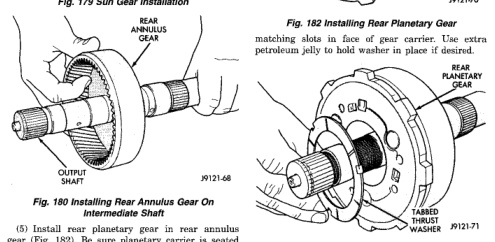
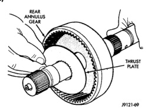
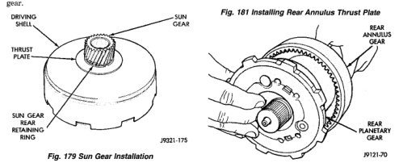

(1) Lubricate sun gear and planetary gears with transmission fluid during assembly. Use petroleum jelly to lubricate intermediate shaft bushing surfaces, thrust washers and thrust plates and to hold these parts in place during assembly. (2) Install front snap ring on sun gear and install gear in driving shell. Then install thrust plate over sun gear and against rear side of driving shell (Fig. 179). Install rear snap ring to secure sun gear and thrust plate in driving shell. (3) Install rear annulus gear on intermediate shaft (Fig. 180).

(4) Install thrust plate in annulus gear (Fig. 181). Be sure plate is seated on shaft splines and against gear.

*Fig. 179 Sun Gear Installation*

(5) Install rear planetary gear in rear annulus gear (Fig. 182). Be sure planetary carrier is seated against annulus gear. (6) Install tabbed thrust washer on front face of rear planetary gear (Fig. 183). Seat washer tabs in

*Fig. 181 Installing Rear Annulus Thrust Plate*

*Fig. 183 Installing Rear Planetary Thrust Washer*

*Fig. 179*

*Fig. 180*
