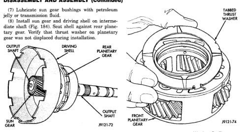
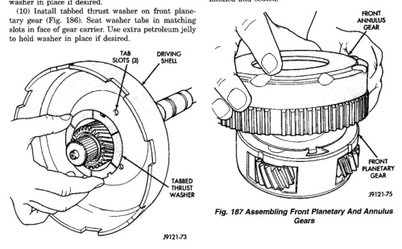

*Fig. 185*

(9) Install tabbed thrust washer in driving shell (Fig. 185), be sure washer tabs are seated in tab slots of driving shell. Use extra petroleum jelly to hold washer in place if desired. (10) Install tabbed thrust washer on front planetary gear (Fig. 186). Seat washer tabs in matching slots in face of gear carrier. Use extra petroleum ielly to hold washer in place if desired.

*Fig. 185 Installing Driving Shell Thrust Washer*

(11) Install front annulus gear over and onto front planetary gear (Fig. 187). Be sure gears are fully meshed and seated.

*Fig. 187 Assembling Front Planetary And Annulus Gears*

*Fig. 186*
