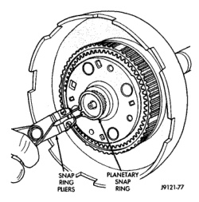
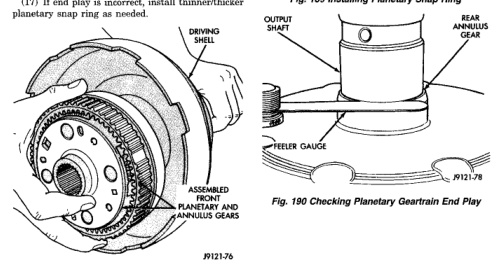

*Fig. 188*

(12) Install front planetary and annulus gear assembly (Fig. 188). Hold gears together and slide them onto shaft. Be sure planetary pinions are seated on sun gear and that planetary carrier is seated on intermediate shaft. (13) Place geartrain in upright position. Rotate gears to be sure all components are seated and properly assembled. Snap ring groove at forward end of intermediate shaft will be completely exposed when components are assembled correctly. (14) Install new planetary snap ring in groove at end of intermediate shaft (Fig. 189). (15) Turn planetary geartrain over. Position wood block under front end of intermediate shaft and support geartrain on shaft. Be sure all geartrain parts have moved forward against planetary snap ring. This is important for accurate end play check. (16) Check planetary geartrain end play with feeler gauge (Fig. 190). Insert gauge between rear annulus gear and shoulder on intermodiate shaft as shown. End play should be 0.15 to 1.22 mm (0.006 to 0.048 in.). (17) If end play is incorrect, install thinner/thicker planetary snap ring as needed.

*Fig. 188 Installing Front Planetary And Annulus Gear Assembly*

*Fig. 189 Installing Planetary Snap Ring*

*Fig. 190 Checking Planetary Geartrain End Play*

*Fig. 190*
