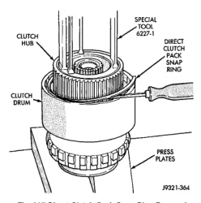
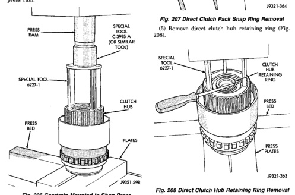

## DISASSEMBLY AND ASSEMBLY (Continued)

### DIRECT CLUTCH, HUB AND SPRING

**NOTE:** The direct clutch in the 46RE uses 8 clutch discs. The direct clutch in the 47RE uses 10 clutch discs.

**WARNING:** THE NEXT STEP IN DISASSEMBLY INVOLVES COMPRESSING THE DIRECT CLUTCH SPRING. IT IS EXTREMELY IMPORTANT THAT PROPER EQUIPMENT BE USED TO COMPRESS THE SPRING AS SPRING FORCE IS APPROXIMATELY 830 POUNDS. USE SPRING COMPRESSOR TOOL 6227-1 AND A HYDRAULIC SHOP PRESS WITH A MINIMUM RAM TRAVEL OF 5-6 INCHES. THE PRESS MUST ALSO HAVE A BED THAT CAN BE ADJUSTED UP OR DOWN AS REQUIRED. RELEASE CLUTCH SPRING TENSION SLOWLY AND COMPLETELY TO AVOID PERSONAL INJURY.

(1) Mount geartrain assembly in shop press (Fig. 206).

(2) Position Compressor Tool 6227-1 on clutch hub (Fig. 206). Support output shaft flange with steel press plates as shown and center assembly under press ram.

*Fig. 206 Geartrain Mounted In Shop Press]*
- PRESS RAM
- SPECIAL TOOL 6227-1 (OR SIMILAR TOOL)
- SPECIAL TOOL 6227-1
- CLUTCH HUB
- PRESS BED
- PLATES

(3) Apply press pressure slowly. Compress hub and spring far enough to expose clutch hub retaining ring and relieve spring pressure on clutch pack snap ring (Fig. 206).

(4) Remove direct clutch pack snap ring (Fig. 207).

*Fig. 207 Direct Clutch Pack Snap Ring Removal]*
- SPECIAL TOOL 6227-1
- CLUTCH HUB
- DIRECT CLUTCH PACK SNAP RING
- PRESS PLATES

(5) Remove direct clutch hub retaining ring (Fig. 208).

[Figure: Fig. 208 Direct Clutch Hub Retaining Ring Removal]
- SPECIAL TOOL 6227-1
- CLUTCH HUB RETAINING RING
- PRESS BED
- PRESS PLATES