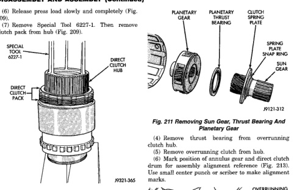
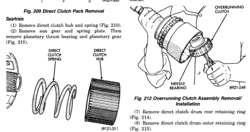

## DISASSEMBLY AND ASSEMBLY (Continued)

(6) Release press load slowly and completely (Fig. 209).

(7) Remove Special Tool 6227-1. Then remove clutch pack from hub (Fig. 209).

*Fig. 209 Direct Clutch Pack Removal]*
- SPECIAL TOOL 6227-1
- DIRECT CLUTCH HUB
- DIRECT CLUTCH PACK

### Geartrain

(1) Remove direct clutch hub and spring (Fig. 210).

(2) Remove sun gear and spring plate. Then remove planetary thrust bearing and planetary gear (Fig. 211).

*Fig. 210 Direct Clutch Hub And Spring Removal]*
- DIRECT CLUTCH HUB
- DIRECT CLUTCH SPRING

[Figure: Fig. 211 Removing Sun Gear, Thrust Bearing And Planetary Gear]
- PLANETARY GEAR
- PLANETARY THRUST BEARING
- CLUTCH SPRING PLATE
- SPRING PLATE SNAP RING
- SUN GEAR

(3) Remove overrunning clutch assembly with expanding type snap ring pliers (Fig. 212). Insert pliers into clutch hub. Expand pliers to grip hub splines and remove clutch with counterclockwise twisting motion.

(4) Remove thrust bearing from overrunning clutch hub.

(5) Remove overrunning clutch from hub.

(6) Note position of annulus gear and direct clutch drum for assembly alignment reference (Fig. 213). Use small center punch or scriber to make alignment marks.

[Figure: Fig. 212 Overrunning Clutch Assembly Removal/Installation]
- OVERRUNNING CLUTCH
- NEEDLE BEARING

(7) Remove direct clutch drum rear retaining ring (Fig. 214).

(8) Remove direct clutch drum outer retaining ring (Fig. 215).

(9) Mark annulus gear and output shaft for assembly alignment reference (Fig. 216). Use punch or scriber to mark gear and shaft.

(10) Remove snap ring that secures annulus gear on output shaft (Fig. 217). Use two screwdrivers to unseat and work snap ring out of groove as shown.