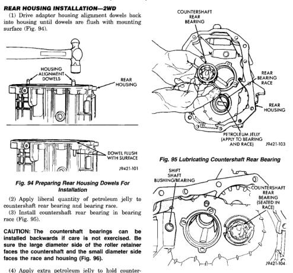

# TRANSMISSION AND TRANSFER CASE 21 - 29

## DISASSEMBLY AND ASSEMBLY (Continued)

### REAR HOUSING INSTALLATION—2WD

(1) Drive adapter housing alignment dowels back into housing until dowels are flush with mounting surface (Fig. 94).

*Fig. 96 Preparing Rear Housing Dowels For Installation]*
- HOUSING ALIGNMENT DOWELS
- REAR HOUSING
- DOWEL FLUSH WITH SURFACE
- PN421-101

(2) Apply liberal quantity of petroleum jelly to countershaft rear bearing and bearing race.

(3) Install countershaft rear bearing in bearing race (Fig. 95).

CAUTION: The countershaft bearings can be installed backwards if care is not exercised. Be sure the large diameter side of the roller retainer faces the race and the small diameter side faces the race and housing (Fig. 96).

(4) Apply extra petroleum jelly to hold countershaft rear bearing in place when housing is installed.

(5) Apply light coat of petroleum jelly to shift shaft bushing/bearing in rear housing (Fig. 96).

(6) Reach into countershaft rear bearing with finger, and push each bearing roller outward against race. Then apply extra petroleum jelly to hold rollers in place. This avoids having rollers becoming displaced during housing installation. This will result in misalignment between bearing and countershaft bearing hub.

[Figure: Fig. 95 Lubricating Countershaft Rear Bearing]
- COUNTERSHAFT REAR BEARING
- REAR HOUSING
- REAR BEARING RACE
- REAR HOUSING
- PETROLEUM JELLY (APPLY TO BEARING AND RACE)
- PN421-103

[Figure: Fig. 96 Countershaft Rear Bearing Seated In Race]
- SHIFT SHAFT BUSHING/BEARING
- COUNTERSHAFT REAR BEARING
- BEARING RACE
- PN421-104