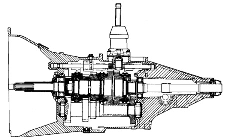

## GENERAL INFORMATION (Continued)

*Fig. 1 NV3500 Manual Transmission - Cross-sectional views showing internal components and assembly of the transmission housing, gears, shafts, and bearings in both upper and lower configurati*