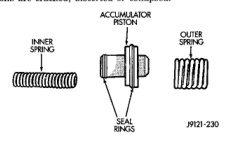

Inspect the transmission bushings during overhaul. Bushing condition is important as worn, scored bushings contribute to low pressures, clutch slip and accelerated wear of other components. However, do not replace bushings as a matter of course. Replace bushings only when they are actually worn, or scored. Use recommended tools to replace bushings. The tools are sized and designed to remove, install, and seat bushings correctly. The bushing replacement tools are included in Bushing Tool Set C-3887-B. for Pre-sized service bushings are available replacement purposes. Only the sun gear bushings are not serviced. Low cost of the sun gear assembly makes it easier to simply replace the gear and bushings as an assembly. Heli-Coil inserts can be used to repair damaged, stripped or worn threads in aluminum parts. These inserts are available from most automotive parts suppliers. Stainless steel inserts are recommended. The use of crocus cloth is permissible where necessary, providing it is used carefully. When used on shafts, or valves, use extreme care to avoid rounding off sharp edges. Sharp edges are vital as they prevent foreign matter from getting between the valve and valve bore. Do not reuse oil seals, gaskets, seal rings, or O-rings during overhaul. Replace these parts as a matter of course. Also do not reuse snap rings or E-clips that are bent or distorted. Replace these parts as well. Lubricate transmission parts with Mopar® ATF Plus, Type 7176, transmission fluid during overhaul and assembly. Use petroleum jelly, Mopar® Door Ease, or Ru-Glyde to prelubricate seals, O-rings, and thrust washers. Petroleum jelly can also be used to hold parts in place during reassembly.

Clean the case in a solvent tank. Flush the case bores and fluid passages thoroughly with solvent. Dry the case and all fluid passages with compressed air. Be sure all solvent is removed from the case and that all fluid passages are clear.

NOTE: Do not use shop towels or rags to dry the case (or any other transmission component) unless thev are made from lint-free materials. Lint will stick to case surfaces and transmission components and circulate throughout the transmission after assembly. A sufficient quantity of lint can block fluid passages and interfere with valve body operation.

Inspect the case for cracks, porous spots, worn bores, or damaged threads. Damaged threads can be repaired with Helicoil thread inserts. However, the case will have to be replaced if it exhibits any type of damage or wear. Lubricate the front band adjusting screw threads with petroleum ielly and thread the screw part-way into the case. Be sure the screw turns freely.

Clean the overrunning clutch assembly, clutch cam, low-reverse drum, and overdrive piston retainer in solvent. Dry them with compressed air after cleaning. Inspect condition of each clutch part after cleaning. Replace the overrunning clutch roller and spring assembly if any rollers or springs are worn or damaged, or if the roller cage is distorted, or damaged. Replace the cam if worn, cracked or damaged. Replace the low-reverse drum if the clutch race. roller surface or inside diameter is scored, worn or damaged. Do not remove the clutch race from the low-reverse drum under any circumstances. Replace the drum and race as an assembly if either component is damaged. Examine the overdrive piston retainer carefully for wear, cracks, scoring or other damage. Be sure the retainer hub is a snug fit in the case and drum. Replace the retainer if worn or damaged.

Inspect the accumulator piston and seal rings (Fig. 252). Replace the seal rings if worn or cut. Replace the piston if chipped or cracked. Check condition of the accumulator inner and outer springs (Fig. 252). Replace the springs if the coils are cracked, distorted or collapsed.

*Fig. 252 Accumulator Components*

Clean the servo piston components with solvent and dry them with compressed air. Wipe the band clean with lint free shop towels.
