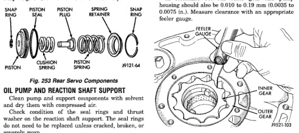

Replace the front band if distorted, lining is burned, flaking off, or worn to the point where the grooves in the lining material are no longer visible. Inspect the servo components. Replace the springs if collansed, distorted or broken. Replace the guide, rod and piston if cracked, bent, or worn. Discard the servo snap ring if distorted or warped. Check the servo piston bore for wear. If the bore is severely scored, or damaged, it will be necessary to replace the case. Replace any servo component if doubt exists about condition. Do not reuse suspect parts.

Remove and discard the servo piston seal ring (Fig. 253). Then clean the servo components with solvent and dry with compressed air. Replace either spring if collapsed, distorted or broken. Replace the plug and piston if cracked, bent, or worn. Discard the servo snap rings and use a new ones at assembly.

Clean pump and support components with solvent and dry them with compressed air. Check condition of the seal rings and thrust washer on the reaction shaft support. The seal rings do not need to be replaced unless cracked, broken, or severely worn. Inspect the pump and support components. Replace the pump or support if the seal ring grooves or machined surfaces are worn, scored, pitted, or damaged. Replace the pump gears if pitted, worn chipped, or damaged. Check the pump vent. The vent must be secure. Replace the pump body if the vent is cracked, broken, or loose. Inspect the pump bushing. Then check the reaction shaft support bushing. Replace either bushing only if heavily worn, scored or damaged. It is not necessary to replace the bushings unless they are actually damaged. (1) Install the gears in the pump body and measure pump component clearances as follows: (a) Clearance between outer gear and reaction shaft housing should be 0.010 to 0.063 mm (0.0004

to 0.0025 in.). Clearance between inner gear and reaction shaft housing should be 0.010 to 0.063 mm (0.0004 to 0.0025 in.). Both clearances can be measured at the same time by: (I) Installing the pump gears in the pump housing. (II) Position an appropriate piece of Plastigage across both gears. (III) Align the plastigage to a flat area on the reaction shaft housing. (IV) Install the reaction shaft to the pump housing. (V) Separate the reaction shaft housing from the pump housing and measure the Plastigage23 following the instructions supplied with it. (b) Clearance between inner gear tooth and outer gear should be 0.08 to 0.19 mm (0.0035 to 0.0075 in.). Measure clearance with an appropriate feeler gauge (Fig. 254). (c) Clearance between outer gear and pump housing should also be 0.010 to 0.19 mm (0.0035 to 0.0075 in.). Measure clearance with an appropriate feeler gauge.

*Flg. 254 Checking Pump Gear Tip Clearance*

Clean and inspect the front clutch components. Replace the clutch discs if warped, worn, scored, burned or charred, the lugs are damaged, or if the facing is flaking off. Replace the steel plates and reaction plate if heavily scored, warped, or broken. Be sure the driving lugs on the discs and plate are also in good condition. The lugs must not be bent, cracked or damaged in any way. Replace the piston springs and spring retainer if either are distorted, warped or broken. Check the lug grooves in the clutch piston retainer. The steel plates should slide freely in the slots. Replace the piston retainer if the grooves are worn or damaged. Also check action of the check ball in the

*Fig. 253*
