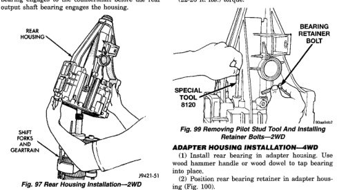

# 21 - 30 TRANSMISSION AND TRANSFER CASE

## DISASSEMBLY AND ASSEMBLY (Continued)

(7) Install rear housing onto geartrain (Fig. 97). Be sure bearing retainer pilot stud is in correct bolt hole in housing. Also be sure countershaft and output shaft bearings are aligned in housing and on countershaft. It may be necessary to lift upward on countershaft slightly to ensure that the countershaft rear bearing engages to the countershaft before the rear output shaft bearing engages the housing.

*Fig. 97 Rear Housing Installation—2WD]*
- REAR HOUSING
- SHIFT FORKS AND GEARS
- PN421-51

(8) Seat rear housing on output shaft rear bearing and countershaft. Use plastic or rawhide mallet to tap housing into place.

(9) Install bearing retainer bolts that secure rear bearing retainer to rear housing as follows:

(a) Apply Mopar® Gasket Maker, or equivalent, to bolt threads, bolt shanks and under bolt heads (Fig. 98).

[Figure: Fig. 98 Applying Sealer To Retainer And Housing Bolts]
- MOPAR GASKET MAKER (OR LOCTITE 518)
- RETAINER AND HOUSING BOLTS
- COUNTERSHAFT REAR BEARING
- APPLY SEALER TO UNDERSIDE OF BOLT HEAD, SHANK AND THREADS
- PN421-102

(b) Start first two bolts in retainer (Fig. 99). It may be necessary to move retainer rearward (with pilot stud) in order to start bolts in retainer.

(c) Remove Pilot Stud 8120 and install last retainer bolt (Fig. 99).

(d) Tighten all three retainer bolts to 30-35 N·m (22-26 ft. lbs.) torque.

[Figure: Fig. 99 Removing Pilot Stud Tool And Installing Retainer Bolts—2WD]
- BEARING RETAINER
- RETAINER BOLT
- SPECIAL TOOL 8120

### ADAPTER HOUSING INSTALLATION—4WD

(1) Install rear bearing in adapter housing. Use wood hammer handle or wood dowel to tap bearing into place.

(2) Position rear bearing retainer in adapter housing (Fig. 100).

[Figure: Fig. 100 Preparing Adapter Housing For Installation—4WD]
- ADAPTER HOUSING
- RETAINER BOLTS (3)
- REAR BEARING RACE
- IDLER GEAR NOTCH
- COUNTERSHAFT REAR BEARING
- PN421-203