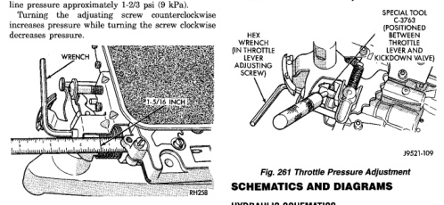

# ADJUSTMENTS (Continued)

## LINE PRESSURE ADJUSTMENT

Measure distance from the valve body to the inner edge of the adjusting screw with an accurate steel scale (Fig. 260).

Distance should be 33.4 mm (1-5/16 in.).

If adjustment is required, turn the adjusting screw in, or out, to obtain required distance setting.

**NOTE: The 33.4 mm (1-5/16 in.) setting is an approximate setting. Manufacturing tolerances may make it necessary to vary from this dimension to obtain desired pressure.**

One complete turn of the adjusting screw changes line pressure approximately 1-2/3 psi (9 kPa).

Turning the adjusting screw counterclockwise increases pressure while turning the screw clockwise decreases pressure.

*Fig. 260 Line Pressure Adjustment]*

## THROTTLE PRESSURE ADJUSTMENT

Insert Gauge Tool C-3763 between the throttle lever cam and the kickdown valve stem (Fig. 261).

Push the gauge tool inward to compress the kickdown valve against the spring and bottom the throttle valve.

Maintain pressure against kickdown valve spring. Turn throttle lever stop screw until the screw head touches throttle lever tang and the throttle lever cam touches gauge tool.

**NOTE: The kickdown valve spring must be fully compressed and the kickdown valve completely bottomed to obtain correct adjustment.**

[Figure: Fig. 261 Throttle Pressure Adjustment
- HEX WRENCH (IN THROTTLE LEVER ADJUSTING SCREW)
- SPECIAL TOOL (POSITIONED BETWEEN THROTTLE LEVER AND KICKDOWN VALVE STEM)]

## SCHEMATICS AND DIAGRAMS

### HYDRAULIC SCHEMATICS