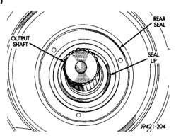
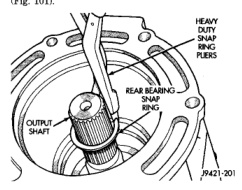

## DISASSEMBLY AND ASSEMBLY (Continued)

(3) Apply Mopar® Gasket Maker, or equivalent, to threads, bolt shanks and under hex heads of bearing retainer bolts (Fig. 101).

(4) Apply liberal quantity of petroleum jelly to countershaft rear bearing and bearing race.

(5) Install countershaft rear bearing in bearing race (Fig. 96).

**CAUTION: The countershaft bearings can be installed backwards if care is not exercised. Be sure the large diameter side of the roller retainer faces the countershaft and the small diameter side faces the race and housing (Fig. 96).**

(6) Apply extra petroleum jelly to hold countershaft rear bearing in place when housing is installed.

(7) Apply light coat of petroleum jelly to shift shaft bushing/bearing in adapter housing (Fig. 96).

(8) Install adapter housing on geartrain.

(9) Install rear bearing snap ring on output shaft (Fig. 101).

*Fig. 101 Installing Rear Bearing Snap Ring—4WD]*
- HEAVY DUTY SNAP RING PLIERS
- REAR BEARING
- OUTPUT SHAFT
- P421-20

(10) Lubricate lip of new rear seal (Fig. 102) with Mopar® Door Ease, or transmission fluid.

(11) Install new rear seal in adapter housing bore with Installer C-3860-A. Be sure seal is fully seated in housing bore (Fig. 102).

### REVERSE IDLER SEGMENT INSTALLATION

(1) Remove geartrain and housing assembly from fixture with aid of helper.

(2) Apply Mopar® Gasket Maker, or equivalent, sealer to underside of idler shaft bolt heads, bolt shanks and bolt threads (Fig. 98).

(3) Align idler shaft and rear housing bolt holes with drift, pin punch, or Phillips screwdriver.

(4) Work segment upward into housing and onto idler shaft.

*Fig. 96 Rear Seal Installation—4WD]*
- REAR BEARING
- SEAL
- OUTPUT SHAFT
- INSTALLER C-3860-A
- P421-04

(5) Verify that idler shaft is seated in housing notch before proceeding. Segment and housing can be damaged if idler shaft is misaligned.

(6) Insert idler shaft retaining bolts through housing and segment and into shaft. Long bolt goes through segment and short bolt goes through housing and directly into rear of shaft.

(7) Tighten idler shaft bolts to 19-25 N·m (14-18 ft. lbs.) torque.

**CAUTION: Make sure the idler shaft and support segment are properly seated and held firmly in place while tightening the shaft bolts. The segment, housing or shaft threads can be damaged if the idler shaft is allowed to shift out of position in the housing.**

### SHIFT SHAFT, SHAFT LEVER AND BUSHING AND SHIFT SOCKET INSTALLATION

(1) Before proceeding, verify that all synchro sleeves are in Neutral position (centered on hub). Move sleeves into neutral if necessary.

**CAUTION: The transmission synchros must all be in Neutral position for proper reassembly. Otherwise, the housings, shift forks and gears can be damaged during installation of the two housings.**

(2) Install 3-4 shift fork in synchro sleeve (Fig. 103). Verify that groove in fork arm is aligned with grooves in 1-2 and fifth-reverse fork arms as shown.

(3) Slide shift shaft through 3-4 shift fork (Fig. 104). Be sure shaft detent notches are to front.

(4) Assemble shift shaft shift lever and bushing (Fig. 105). Be sure slot in bushing is facing up and roll pin hole for lever is aligned with hole in shaft.

(5) Install assembled lever and bushing on shift shaft (Fig. 106).