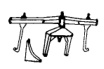
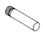
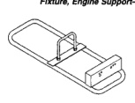

*Fig. 1*

DOC

RE TRANSMISSION

*Fig. 6*

*Fig. 7*

*Fig. 8*

*Installer-6951*

[Figure]

Retainer, Detent Ball and Spring-6583

[Figure]

Gauge Block-6312

[Figure]

Fixture, Engine Support-C-3487-A

[Figure]

*Transmission Repair Stand-C-3750-B*
