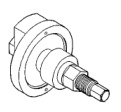
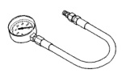
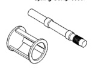
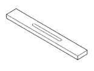
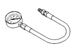
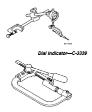
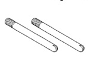

21 - 326 TRANSMISSION AND TRANSFER CASE - SPECIAL TOOLS (Continued)

*Fig. 1*

Spring Compressor-C-3863-A

*Fig. 2*

Spring Compressor and Alignment Shaft-6227

*Fig. 3*

*Gauge Bar-6311*

*Fig. 4*

*Extension Housing Pilot-C-3288-B*

*Fig. 5*

Pressure Gauge-C-3292

*Fig. 6*

Pressure Gauge-C-3293SP

*Fig. 7*

*Spring Compressor-C-3422-B*
