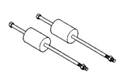

## TRANSMISSION AND TRANSFER CASE 21 - 327

### SPECIAL TOOLS (Continued)

*Fig. 1 Special Tools - Various transmission service tools*
- Puller, Slide Hammer—C-3752
- Overdrive Piston Seal Installer—8114
- Gauge, Throttle Setting—C-3763
- Installer—C-3995-A
- Seal Installer—C-3860-A
- Universal Handle—C-4171
- Seal Remover—C-3985-B
- Remover/Installer—C-4470