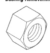

## 21 - 328 TRANSMISSION AND TRANSFER CASE

### SPECIAL TOOLS (Continued)

*Fig. 4 Special Tools - Additional transmission service tools*
- Dial Caliper—C-4962
- Cup, Bushing Remover—SP-3633, From kit C-3887-J
- Bushing Remover/Installer Set—C-3887-J
- Installer, Oil Pump Bushing—SP-5118, From kit C-3887-J
- Nut, Bushing Remover—SP-1191, From kit C-3887-J
- Remover, Reaction Shaft Bushing—SP-5301, From kit C-3887-J
- Remover, Front Clutch Bushing—SP-3629, From kit C-3887-J
- Installer, Reaction Shaft Bushing—SP-5302, From kit C-3887-J