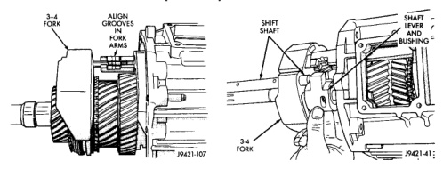
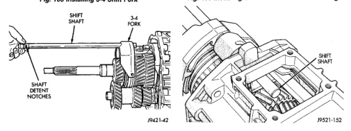

## DISASSEMBLY AND ASSEMBLY (Continued)

*Fig. 103 Installing 3-4 Shift Fork]*
- 3-4 FORK
- ALIGN GROOVES
- SHIFT SHAFT
- P421-107

*Fig. 104 Installing Shift Shaft Lever And Bushing]*
- SHAFT LEVER
- LEVER BUSHING
- SHIFT SHAFT
- P421-41

[Figure: Fig. 104 Shift Shaft Installation]
- SHIFT SHAFT
- 3-4 FORK
- SHAFT DETENT NOTCHES
- P421-42

[Figure: Fig. 107 Inserting Shaft Into Lever Opening In Housing]
- SHIFT SHAFT
- SHIFT LEVER
- P421-120

[Figure: Fig. 105 Assembling Shift Shaft Lever And Bushing]
- SHIFT LEVER
- LEVER BUSHING
- ROLL PIN
- BUSHING LOCK PIN HOLE
- P421-88

(6) Slide shift shaft through 1-2 and fifth-reverse fork and into shift lever opening in rear housing (Fig. 107).

(7) Align shift socket with shaft and slide shaft through socket and into shift shaft bearing in rear housing (Fig. 108).

[Figure: Fig. 108 Shift Socket Installation]
- SHIFT SOCKET
- SHIFT SHAFT
- P421-123