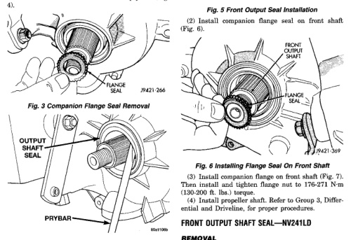
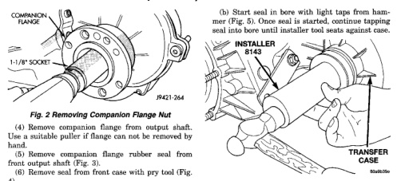

*Fig. 2*

(1) Install new front output seal in front case with Installer Tool 8143 as follows: (a) Place new seal on tool. Garter spring on seal goes toward interior of case.

(1) Shift transfer case into neutral. (2) Remove companion flange nut (Fig. 8). Discard nut after removal. It is not reusable. (3) Remove companion flange from output shaft. Use a suitable puller if flange can not be removed by hand.

*Fig. 8*
