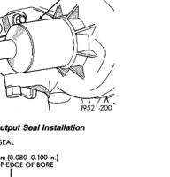

# REMOVAL AND INSTALLATION (Continued)

*Fig. 10 Installing Companion Flange On Front Shaft*

*Fig. 11 Removing Companion Flange Nut]*

(4) Remove companion flange rubber seal from front output shaft (Fig. 9).

[Figure: Fig. 9 Companion Flange Seal Removal
- COMPANION FLANGE
- RUBBER SEAL]

(5) Remove front output shaft seal with suitable pry tool, or a slide hammer mounted screw.

## INSTALLATION

(1) Install new front output seal in front case with Installer Tool 6888 and Tool Handle C-4171 (Fig. 10) as follows:

(a) Place new seal on tool. Garter spring on seal goes toward interior of case.

(b) Start seal in bore. Once seal is started, continue tapping seal into bore until installer tool bottoms against case.

(c) Remove installer and verify that seal is recessed the proper amount. Seal should be 2.03 to 2.5 mm (0.080 to 0.100 in.) below top edge of seal bore in front case (Fig. 11). This is correct final seal position.

**CAUTION: Be sure the front output seal is seated below the top edge of the case bore as shown. The seal could loosen, or become cocked if not seated to recommended depth.**

[Figure: Fig. 10 Front Output Seal Installation
- SPECIAL TOOL C-4171
- SPECIAL TOOL 6888]

[Figure: Fig. 11 Checking Front Output Seal Installation Depth
- CORRECT SEAL DEPTH 2.03 to 2.5 mm (0.080-0.100 in.) BELOW TOP EDGE OF BORE
- FRONT OUTPUT SEAL
- FRONT CASE SHAFT BORE]