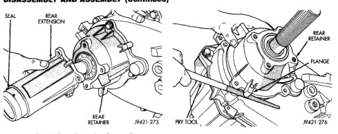
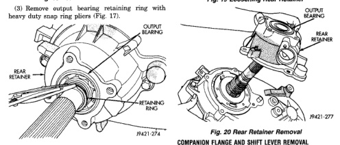
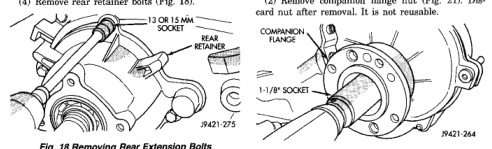

*Fig. 17*

38

DISASSEMBLY AND ASSEMBLY (Continued)

Fig. 17 Removing Output Bearing Retaining Ring (4) Remove rear retainer bolts (Fig. 18).

*Fig. 18 Removing Rear Extension Bolts*

(5) Loosen rear retainer with pry bar placed under flange (Fig. 19). (6) Remove rear retainer and output bearing as assembly (Fig. 20).

*Fig. 19 Loosening Rear Retainer*

*Fig. 20 Rear Retainer Removal*

(1) Shift transfer case into neutral. (2) Remove companion flange nut (Fig. 21). Discard nut after removal. It is not reusable.

*Fig. 21 Removing Companion Flange Nut*

(3) Remove companion flange from front output shaft. Use a suitable puller if flange can not be removed by hand.

*Fig. 18*

*Fig. 19*
