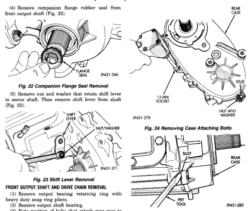
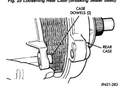

*Fig. 24*

(1) Remove output bearing retaining ring with heavy duty snap ring pliers. (2) Remove output shaft bearing. (3) Note position of bolts that attach rear case to front case (Fig. 24). Some bolts/studs at ends of case require flat washers. Mark position of these bolts with paint or scriber. (4) Remove rear case-to-front case bolts. (5) Loosen rear case with pry tool to break sealer bead. Insert tool in slot at each end of case (Fig. 25). (6) Unseat rear case from alignment dowels (Fig. 26). (7) Remove rear case and oil pump assembly from front case.

*Fig. 24 Removing Case Attaching Bolts*

Flg. 25 Loosening Rear Case (Breaking Sealer Bead)

*Fig. 25 Removing Rear Case From Alignment Dowels*
