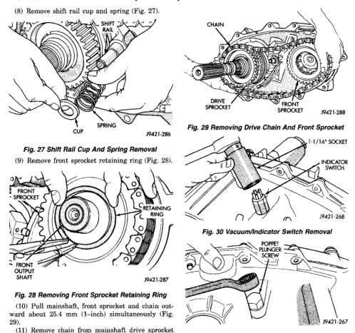
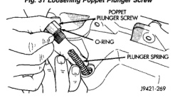

*Fig. 29*

(10) Pull mainshaft, front sprocket and chain outward about 25.4 mm (1-inch) simultaneously (Fig. 29). (11) Remove chain from mainshaft drive sprocket and remove front sprocket and chain as assembly.

(1) Remove vacuum/indicator switch (Fig. 30). (2) Loosen poppet plunger screw (Fig. 31). (3) Remove poppet plunger screw and spring (Fig. 32). Note that screw has O-ring seal. Remove and discard seal this seal.

Fig. 31 Loosening Poppet Plunger Screw

*Fig. 30 Poppet Plunger Screw And Spring Removal*
