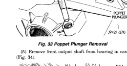
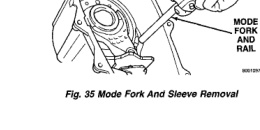

*Fig. 33*

21 - 340 TRANSMISSION AND TRANSFER CASE -

(4) Remove poppet plunger with magnet (Fig. 33).

(6) Pull mainshaft assembly out of input gear, mode sleeve and case. (7) Remove mode fork, mode sleeve, and shift rail as assembly (Fig. 35). Note which way sleeve fits in fork (short side of sleeve goes to front).

*Fig. 35 Mode Fork And Sleeve Removal*

(8) Remove range fork retaining ring. Remove range fork and hub as an assembly (Fig. 36). Note fork position for installation reference. (9) Remove shift sector (Fig. 37).

*Fig. 36 Range Fork And Hub Removal*

*Fig. 37 Shift Sector Removal*
