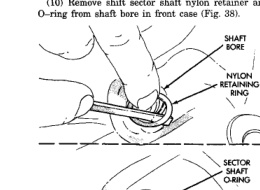
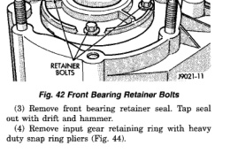

*Fig. 38*

0000

*Fig. 38 Removing Sector Shaft O-Ring And Retainer*

(1) Remove front bearing retainer attaching bolts (Fig. 42). (2) Remove front bearing retainer. Pry retainer loose with pry tool positioned in slots at each end of retainer (Fig. 43).

*Fig. 41 Drive Sprocket Removal*

(3) Remove front bearing retainer seal. Tap seal out with drift and hammer. (4) Remove input gear retaining ring with heavy duty snap ring pliers (Fig. 44).

*Fig. 42*
