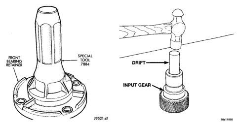
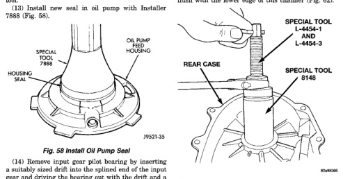

*Fig. 58*

000

(12) Remove seal from oil pump with suitable pry tool (13) Install new seal in oil pump with Installer 7888 (Fig. 58).

(14) Remove input gear pilot bearing by inserting a suitably sized drift into the splined end of the input gear and driving the bearing out with the drift and a hammer (Fig. 59). (15) Install new pilot bearing with Plug C-293-3. (16) Remove the output shaft rear bearing with the screw and jaws from Remover L-4454 and Cup 8148 (Fig. 60). (17) Install new bearing with Tool Handle C-4171 and Installer 5066 (Fig. 61). The bearing bore is

chamfered at the top. Install the bearing so it is flush with the lower edge of this chamfer (Fig. 62).

(1) Lubricate gears and thrust washers (Fig. 63) with recommended transmission fluid. (2) Install first thrust washer in low range gear (Fig. 63). Be sure washer tabs are properly aligned in gear notches.

*Fig. 59*
