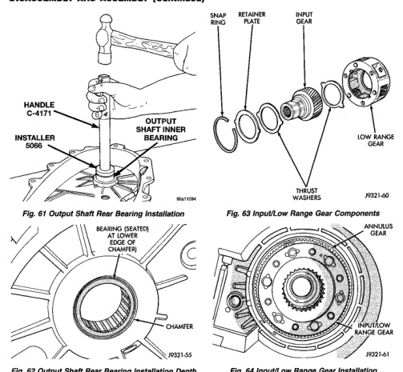

*Fig. 62 Output Shaft Rear Bearing Installation Depth*

(3) Install input gear in low range gear. Be sure input gear is fully seated. (4) Install remaining thrust washer in low range gear and on top of input gear. Be sure washer tabs are properly aligned in gear notches. (5) Install retainer on input gear and install snapring.

(1) Align and install low range/input gear assembly in front case (Fig. 64). Be sure low range gear pinions are engaged in annulus gear and that input gear shaft is fully seated in front bearing. (2) Install snap-ring to hold input/low range gear into front bearing (Fig. 65).

*Fig. 63 Input/Low Range Gear Components*

(3) Clean gasket sealer residue from retainer and inspect retainer for cracks or other damage. (4) Apply a 3 mm (1/8 in.) bead of Mopar® gasket maker or silicone adhesive to sealing surface of retainer. (5) Align cavity in seal retainer with fluid return hole in front of case.

CAUTION: Do not block fluid return cavity on sealing surface of retainer when applying Mopar® gasket maker or silicone adhesive sealer. Seal failure and fluid leak can result.

(6) Install bolts to hold retainer to transfer case (Fig. 66). Tighten to 21 N-m (16 ft. lbs.) of torque.
