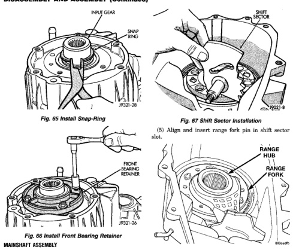
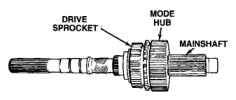

*Fig. 67*

(1) Lubricate mainshaft splines with recommended transmission fluid. (2) Slide drive sprocket onto mainshaft. (3) Slide mode hub onto mainshaft. (4) Install mode hub retaining ring. Verify that the retaining ring is fully seated in mainshaft groove.

(1) Support front case on wood blocks so case interior is facing up. Place blocks between mounting studs on forward surface of case. Be sure blocks will not interfere with input gear installation. (2) Lubricate mainshaft components with Dexron II transmission fluid. (3) Lubricate sector shaft with transmission fluid and install shift sector in case (Fig. 67). Position slot in sector so it will be aligned with shift fork pin when shift forks are installed. (4) Assemble and install range fork and hub (Fig. 68). Be sure hub is properly seated in low range gear and engaged to the input gear.

(6) Install assembled mainshaft (Fig. 69). Be sure shaft is seated in pilot bearing and input gear.

*Fig. 68*

(7) Install new pads on mode fork if necessary. (8) Insert mode sleeve in mode fork mode fork. Be sure long side of sleeve is toward long end of shift rail (Fig. 70).
