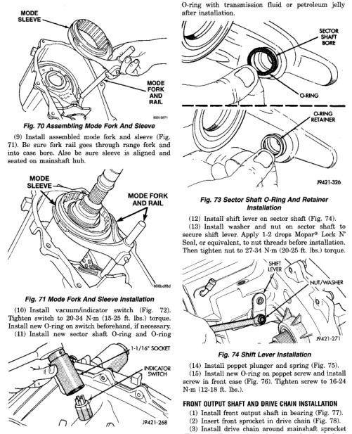

*Fig. 72 Vacuum/Indicator Switch Installation*

retainer in sector shaft bore (Fig. 73). Lubricate

O-ring with transmission fluid or petroleum jelly

(1) Install front output shaft in bearing (Fig. 77). (2) Insert front sprocket in drive chain (Fig. 78). (3) Install drive chain around mainshaft sprocket (Fig. 78). Then position front sprocket over front shaft.
