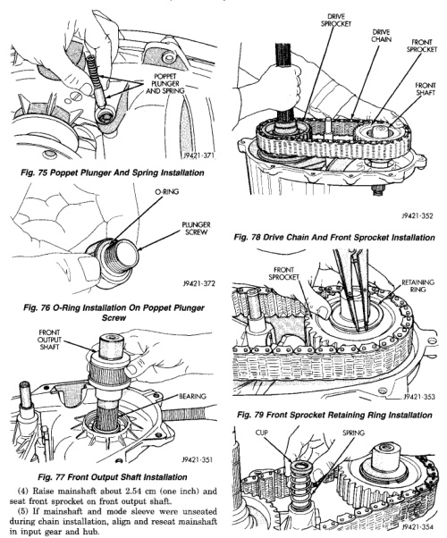

*Fig. 76 O-Ring Installation On Poppet Plunger*

(4) Raise mainshaft about 2.54 cm (one inch) and seat front sprocket on front output shaft. (5) If mainshaft and mode sleeve were unseated during chain installation, align and reseat mainshaft in input gear and hub. (6) Install front sprocket retaining ring (Fig. 79). (7) Install spring and cup on shift rail (Fig. 80). (8) Insert magnet in front case pocket (Fig. 81).

*Fig. 79 Front Sprocket Retaining Ring Installation*

*Fig. 80 Shift Rail Spring And Cup Installation*
