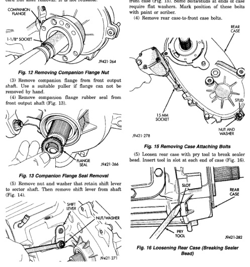

*Fig. 12*

(5) Separate extension housing from transfer case.

(1) Shift transfer case into neutral. (2) Remove companion flange nut (Fig. 12). Discard nut after removal. It is not reusable.

*Fig. 14 Shift Lever Removal*

(1) Remove output bearing retaining ring with heavy duty snap ring pliers. (2) Remove output shaft bearing. (3) Note position of bolts that attach rear case to front case (Fig. 15). Some bolts/studs at ends of case require flat washers. Mark position of these bolts with paint or scriber. (4) Remove rear case-to-front case bolts.

*Fig. 16 Loosening Rear Case (Breaking Sealer Bead)*
