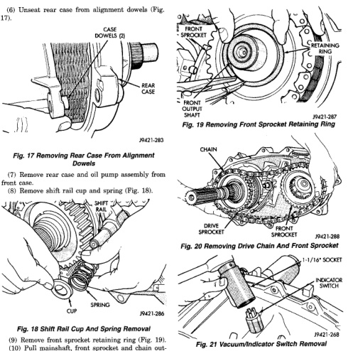
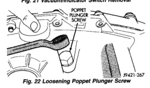

*Fig. 19*

(9) Remove front sprocket retaining ring (Fig. 19). (10) Pull mainshaft, front sprocket and chain outward about 25,4 mm (1-inch) simultaneously (Fig. 20). (11) Remove chain from mainshaft drive sprocket and remove front sprocket and chain as assembly.

(1) Remove vacuum/indicator switch (Fig. 21). (2) Loosen poppet plunger screw (Fig. 22).

*Fig. 20*
