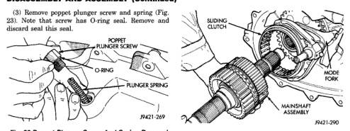
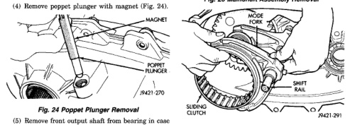
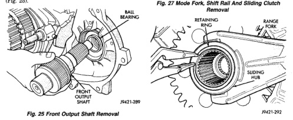

*Fig. 23*

Fig. 23 Poppet Plunger Screw And Spring Removal

(4) Remove poppet plunger with magnet (Fig. 24).

(5) Remove front output shaft from bearing in case (Fig. 25).

(6) Pull mainshaft assembly out of input gear, sliding clutch and case (Fig. 26). (7) Remove mode fork, sliding clutch and shift rail as assembly (Fig. 27). Note which way clutch fits in fork (long side of clutch goes to front). (8) Remove range fork retaining ring (Fig. 28).

*Fig. 26 Mainshaft Assembly Removal*

*Fig. 27 Mode Fork, Shift Rail And Sliding Clutch Removal*

*Fig. 28 Range Fork Retaining Ring Removal*

*Fig. 24*

*Fig. 25*
