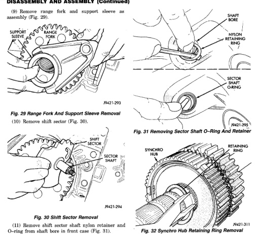
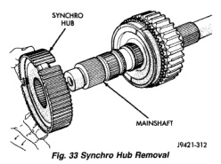

*Fig. 31*

21

(11) Remove shift sector shaft nylon retainer and O-ring from shaft bore in front case (Fig. 31).

(1) Remove retaining ring that secures synchro hub on mainshaft (Fig. 32). Use standard (instead of parallel jaw) snap ring pliers to remove this retaining ring. (2) Remove synchro hub (Fig. 33).

*Fig. 31 Removing Sector Shaft O-Ring And Retainer*

*Fig. 32 Synchro Hub Removal*
