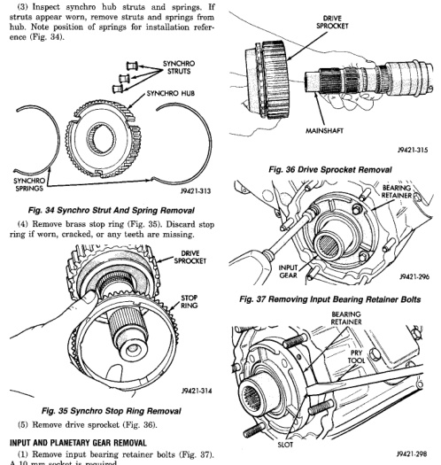

*Fig. 34*

000

33

(3) Inspect synchro hub struts and springs. If struts appear worn, remove struts and springs from hub. Note position of springs for installation reference (Fig. 34).

*Fig. 35 Synchro Stop Ring Removal*

(1) Remove input bearing retainer bolts (Fig. 37). A 10 mm socket is required. (2) Loosen bearing retainer with pry tool. Insert tool in retainer slot as shown (Fig. 38). Then remove retainer.

*Fig. 37 Removing Input Bearing Retainer Bolts*

Fig. 38 Loosening/Removing Input Bearing Retainer
