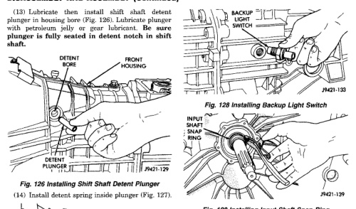
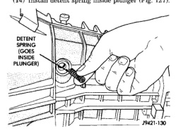
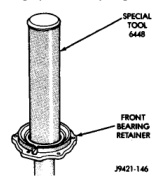

*Fig. 128*

*Fig. 129*

(15) Install detent plug as follows: (a) Install detent plug in end of Installer 8123. (b) Position plug on detent spring and compress spring until detent plug pilots in detent plunger bore. (c) Drive detent plug into transmission case until plug seats. (16) Install backup light switch (Fig. 128). (17) Install input shaft snap ring (Fig. 129). (18) Install new oil seal in front bearing retainer with Installer Tool 6448 (Fig. 130). (19) Apply bead of Mopar® silicone sealer, or equivalent, to flange surface of front bearing retainer (Fig. 131).

*Fig. 129 Installing Input Shaft Snap Ring*

*Fig. 130 Installing Oil Seal In Front Bearing Retainer*

(20) Align and install front bearing retainer over input shaft and onto housing mounting surface (Fig. 132). Although retainer is one-way fit on housing, be sure bolt holes are aligned before seating retainer. Be sure that no sealer gets into the oil feed hole in the transmission case or bearing retainer. (21) Install and tighten bearing retainer bolts to 7-10 N.m (5-7 ft. lbs.) torque (Fig. 133).
