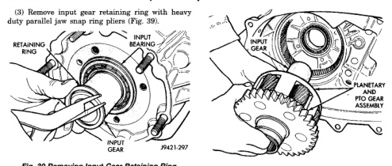
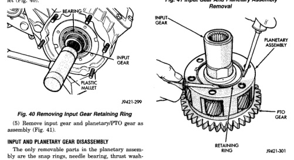

*Fig. 40*

(4) Tap input gear out of bearing with plastic mallet (Fig. 40).

The only removable parts in the planetary assembly are the snap rings, needle bearing, thrust washers, lock ring, input gear, and support sleeve. The planetary carrier, PTO gear, planetary pinions, and remaining planetary components are fixed parts and are serviced as an assembly. (1) Position planetary assembly so PTO gear is on bench (Fig. 42). (2) Remove retaining ring that secures input gear and lock ring in planetary assembly.

J9421-300

*Fig. 41 Input Gear And Planetary Assembly Removal*

*Fig. 42 Removing Lock Ring/Input Gear Retaining Rina*

*Fig. 42*
