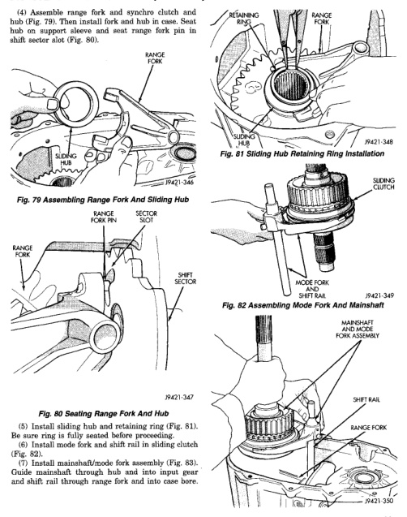

# BR TRANSMISSION AND TRANSFER CASE 21 - 379

## DISASSEMBLY AND ASSEMBLY (Continued)

(4) Assemble range fork and synchro clutch and hub (Fig. 79). Then install fork and hub in case. Seat hub on support sleeve and seat range fork pin in shift sector slot (Fig. 80).

*Fig. 79 Assembling Range Fork And Sliding Hub]*
- RANGE FORK
- SYNCHRO CLUTCH
- P4421-346

[Figure: Fig. 80 Seating Range Fork And Hub]
- RANGE FORK PIN
- SECTOR SLOT
- RANGE FORK
- SHIFT SECTOR
- P4421-347

(5) Install sliding hub and retaining ring (Fig. 81).

(6) Ensure ring is fully seated before proceeding.

(6) Install mode fork and shift rail in sliding clutch (Fig. 82).

(7) Install mainshaft/mode fork assembly (Fig. 83). Guide mainshaft through hub and into input gear and shift rail through range fork and into case bore.

[Figure: Fig. 81 Sliding Hub Retaining Ring Installation]
- RETAINING RING
- RANGE FORK
- SLIDING HUB
- P4421-348

[Figure: Fig. 82 Assembling Mode Fork And Mainshaft]
- SLIDING CLUTCH
- MODE FORK
- SHIFT RAIL
- P4421-349

[Figure: Fig. 83 Installing Mainshaft And Mode Fork Assembly]
- MAINSHAFT AND MODE FORK ASSEMBLY
- SHIFT RAIL
- RANGE FORK
- P4421-350