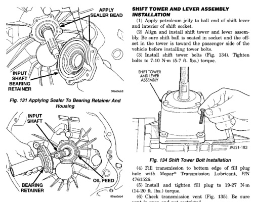
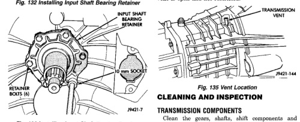

*Fig. 131 Applying Sealer To Bearing Retainer And Housing*

*Fig. 132 Installing Input Shaft Bearing Retainer*

*Fig. 133 Installing Input Shaft Bearing Retainer Bolts*

(4) Fill transmission to bottom edge of fill plug hole with Mopar® Transmission Lubricant, P/N 4761526. (5) Install and tighten fill plug to 19-27 N-m (14-20 ft. Ibs.) torque. (6) Check transmission vent (Fig. 135). Be sure vent is open and not restricted.

Clean the gears, shafts, shift components and transmission housings with a standard parts cleaning solvent. Do not use acid or corrosive base solvents. Dry all parts except bearings with compressed air

*Fig. 132*
