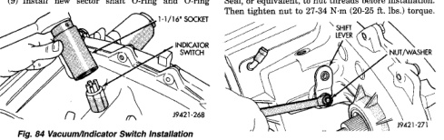
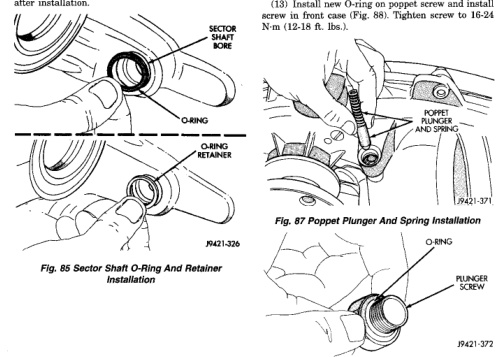

# 21 - 380 TRANSMISSION AND TRANSFER CASE BR

## DISASSEMBLY AND ASSEMBLY (Continued)

(8) Install vacuum/indicator switch (Fig. 84). Tighten switch to 20-34 N·m (15-25 ft. lbs.) torque. Install new O-ring on switch beforehand, if necessary.

(9) Install new sector shaft O-ring and O-ring retainer in sector shaft bore (Fig. 85). Lubricate O-ring with transmission fluid or petroleum jelly after installation.

*Fig. 84 Vacuum/Indicator Switch Installation]*
- 3-4/16" SOCKET
- P4421-268

*Fig. 85 Sector Shaft O-Ring And Retainer Installation]*
- SECTOR SHAFT BORE
- O-RING
- O-RING RETAINER
- P4421-326

(10) Install shift lever on sector shaft (Fig. 86).

(11) Install washer and nut on sector shaft to secure shift lever. Apply 1-2 drops Mopar® Lock N' Seal, or equivalent, to nut threads before installation. Then tighten nut to 27-34 N·m (20-25 ft. lbs.) torque.

[Figure: Fig. 86 Shift Lever Installation]
- SHIFT LEVER
- INDICATOR SWITCH
- NUT/WASHER
- P4421-271

(12) Install poppet plunger and spring (Fig. 87).

(13) Install new O-ring on poppet screw and install screw in front case (Fig. 88). Tighten screw to 16-24 N·m (12-18 ft. lbs.).

[Figure: Fig. 87 Poppet Plunger And Spring Installation]
- PLUNGER
- P4421-371

[Figure: Fig. 88 O-Ring Installation On Poppet Plunger Screw]
- O-RING
- PLUNGER SCREW
- P4421-372