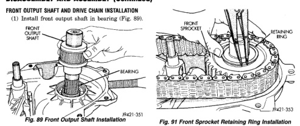
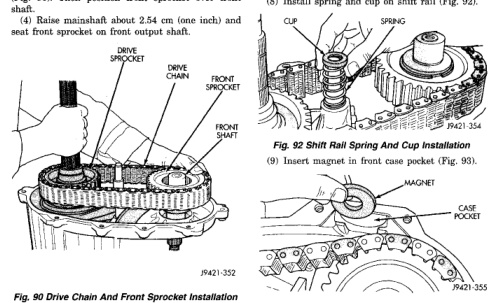

# DISASSEMBLY AND ASSEMBLY (Continued)

## FRONT OUTPUT SHAFT AND DRIVE CHAIN INSTALLATION

(1) Install front output shaft in bearing (Fig. 89).

*Fig. 90 Front Output Shaft Installation]*
- Front output shaft
- Bearing
- Front shaft

(2) Insert front sprocket in drive chain (Fig. 90).

(3) Install drive chain around mainshaft sprocket (Fig. 90). Then position front sprocket over front shaft.

(4) Raise mainshaft about 2.54 cm (one inch) and seat front sprocket on front output shaft.

*Fig. 91 Drive Chain And Front Sprocket Installation]*
- Cup
- Spring
- Shift rail
- Drive chain
- Front sprocket
- Front shaft

(5) If mainshaft and sliding clutch were unseated during chain installation, align and reseat mainshaft in input gear and hub. Then reseat synchro hub in sliding clutch. Press synchro struts inward to ease clutch back onto hub.

(6) Install front sprocket retaining ring (Fig. 91).

(7) Realign sliding clutch on synchro hub if necessary. Press synchro struts inward to ease realignment.

[Figure: Fig. 91 Front Sprocket Retaining Ring Installation]
- Front sprocket
- Retaining ring
- Front shaft

Be sure mainshaft is fully seated before proceeding.

(8) Install spring and cup on shift rail (Fig. 92).

[Figure: Fig. 92 Shift Rail Spring And Cup Installation]
- Cup
- Spring
- Shift rail

(9) Insert magnet in front case pocket (Fig. 93).

[Figure: Fig. 93 Case Magnet Installation]
- Magnet
- Case pocket

## OIL PUMP AND REAR CASE ASSEMBLY/INSTALLATION

Lubricate the oil pump components with Dexron II before installation. Prime the oil pickup tube by pouring a little oil into the tube before installation.

(1) Install new O-ring in pickup tube inlet of oil pump (Fig. 94).

(2) Position oil pickup tube and filter in rear case. Be sure pickup filter is seated in case pocket and