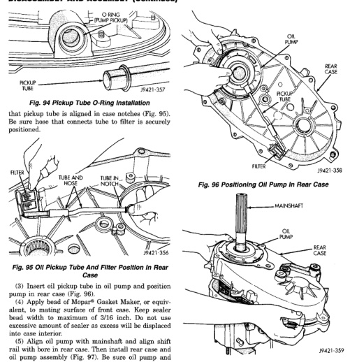

# DISASSEMBLY AND ASSEMBLY (Continued)

*Fig. 95 Pickup Tube O-Ring Installation]*
- O-ring
- Fluid pickup
- Pickup tube

that pickup tube is aligned in case notches (Fig. 95). Be sure hose that connects tube to filter is securely positioned.

[Figure: Fig. 95 Oil Pickup Tube And Filter Position In Rear Case]
- Filter
- Tube add
- Tube in

(3) Insert oil pickup tube in oil pump and position pump in rear case (Fig. 96).

(4) Apply bead of Mopar® Gasket Maker, or equivalent, to mating surface of front case. Keep sealer bead width to maximum of 3/16 inch. Do not use excessive amount of sealer as excess will be displaced into case interior.

(5) Align oil pump with mainshaft and align shift rail with bore in rear case. Then install rear case and oil pump assembly (Fig. 97). Be sure oil pump and pickup tube remain in position during case installation.

(6) Install 4-5 rear case-to front case bolts to hold rear case in position. Tighten bolts snug but not to specified torque at this time.

**CAUTION: Verify that shift rail (Fig. 98), and case alignment dowels are seated before installing any bolts. Case could be cracked if shaft rail or dowels are misaligned.**

[Figure: Fig. 96 Positioning Oil Pump In Rear Case]
- Oil pump
- Rear case
- Filter
- Pickup tube

[Figure: Fig. 97 Rear Case And Oil Pump Installation]
- Mainshaft
- Oil pump
- Gear case

(7) Verify that oil pump is aligned and seated on rear case. Reposition pump if necessary.

(8) Check stud at end of case halves (Fig. 99). If stud was loosened or came out during disassembly, apply Loctite 242 to stud threads and reseat stud in case.

(9) Apply Loctite 242 to remainder of rear case-to-front case bolt threads and install bolts. Be sure lock washers are used on studs/bolts at case ends. Tighten bolts, or stud nuts as follows: