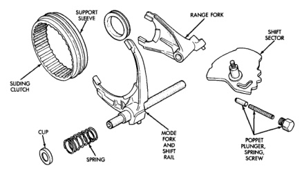
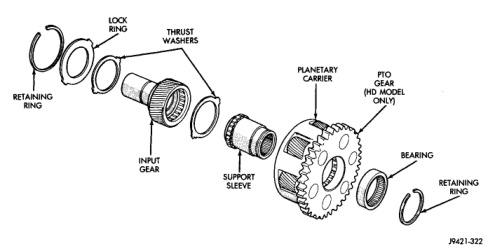

# TRANSMISSION AND TRANSFER CASE 21 - 385

## CLEANING AND INSPECTION (Continued)

*Fig. 105 Shift Fork Components]*
- SUPPORT SLEEVE
- SLIDING CLUTCH
- RANGE FORK
- SHIFT SECTOR
- CUP
- SPRING
- MODE FORK AND SHIFT RAIL
- SHIFT RAIL PLUNGER, SPRING, SCREW

(Fig. 105). The shift sector shaft and detents should be inspected for wear. The mode fork and shift rail are a one-piece unit. If either part is damaged, replace the fork and rail as an assembly. Replace the shift rail cup and spring if they exhibit wear.

Inspect the planetary thrust washers (Fig. 106) carefully for wear or damage. Replace both washers if necessary.

The planetary carrier cannot be disassembled. It must be serviced as an assembly if damaged. Check condition of the pinion teeth and PTO gear teeth. If pinion tooth wear is evident, it will also be necessary to check condition of the annulus gear teeth.

*Fig. 106 Planetary And Input Gear Components]*
- LOCK RING
- THRUST WASHERS
- RETAINING RING
- INPUT GEAR
- SUPPORT SLEEVE
- PLANETARY CARRIER
- PTO GEAR (HD MODEL ONLY)
- BEARING
- RETAINING RING