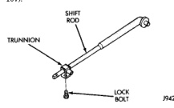

# 21 - 386 TRANSMISSION AND TRANSFER CASE

## ADJUSTMENTS

### SHIFT LEVER ADJUSTMENT

(1) Move shift lever into 2H position.

(2) Raise vehicle.

(3) Loosen shift rod lock bolt at trunnion (Fig. 107).

*Fig. 107 Shift Rod Lock Bolt Location]*
- SHIFT ROD
- TRUNNION
- LOCK BOLT

(4) Check shift rod fit in trunnion. Be sure rod does not bind in trunnion.

(5) Verify that transfer case shift lever is in 2H position. The 2H position on the transfer case shift arm is the second position from full forward.

(6) Lower vehicle.

(7) Position the shift lever on the cab such that the distance from the instrument panel to the 2H position dot in the shift lever insert is 14.6 cm (5.75 in.). Ensure that the measurement is made parallel to the floor of the vehicle.

(8) Tighten shift rod lock bolt to 10 N·m (90 in. lbs.) torque.

(9) Check shift linkage operation. Be sure transfer case shifts into and operates properly in all ranges.

## SPECIFICATIONS

### TORQUE

| DESCRIPTION | TORQUE |
|-------------|--------|
| Plug, Detent | 16-24 N·m (12-18 ft. lbs.) |
| Bolt, Diff. Case | 47-62 N·m (15-24 ft. lbs.) |
| Plug, Drain/Fill | 40-45 N·m (30-40 ft. lbs.) |
| Bolt, Extension Housing | 35-46 N·m (26-34 ft. lbs.) |
| Bolt, Front Brg. Retainer | 16-27 N·m (12-20 ft. lbs.) |
| Bolt, Case Half | 35-46 N·m (26-34 ft. lbs.) |
| Nut, Front Yoke | 122-176 N·m (90-130 ft. lbs.) |
| Screw, Oil Pump | 1.2-1.8 N·m (12-15 in. lbs.) |
| Nut, Range Lever | 9.7-13 N·m (86-96 in. lbs.) |
| Nuts, Mounting | 35-47 N·m |
| Bolts, U-Joint | 19 N·m (17 ft. lbs.) |
| Vacuum Switch | 20-34 N·m (15-25 ft. lbs.) |