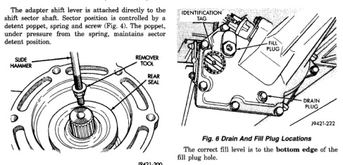
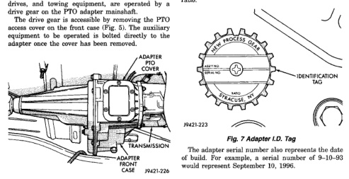

*Fig. 5*

J9421-200

Power take-off accessories such as pumps, gear drives, and towing equipment, are operated by a drive gear on the PTO adapter mainshaft. The drive gear is accessible bv removing the PTO access cover on the front case (Fig. 5). The auxiliary equipment to be operated is bolted directly to the adapter once the cover has been removed.

Recommended lubricant for the NV 021 is Mopar Dexron II, or ATF Plus transmission fluid. Approximate fluid capacity is 2.17 liters (4.6 pints). The adapter fill and drain plugs are located in the rear extension (Fig. 6).

A round, identification tag (Fig. 7) is attached to the rear extension. The tag provides the adapter model number, assembly number, serial number, and ratio.

The NV 021 is a dual range unit. Operating ranges consist of drive (D) and neutral (N). D range is used for normal driving and for PTO accessory operation while the vehicle is in motion.

*Fig. 6*
